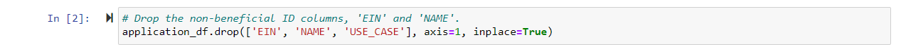
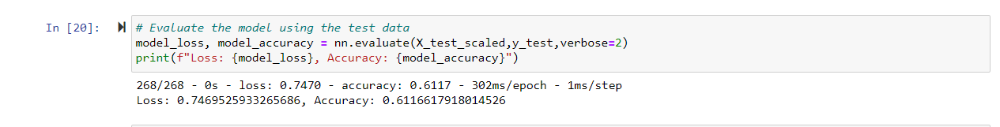
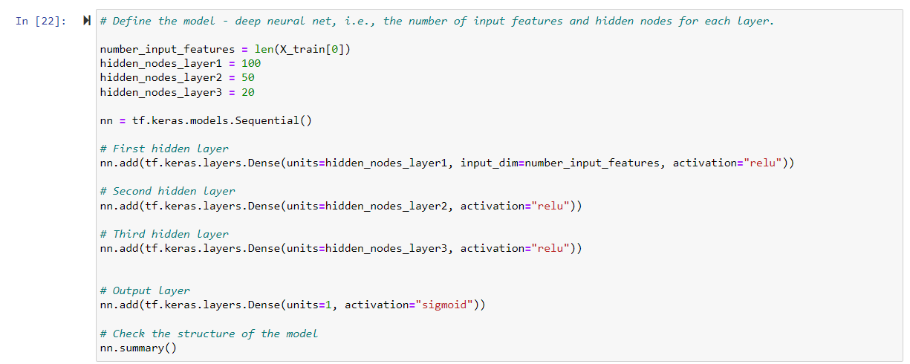
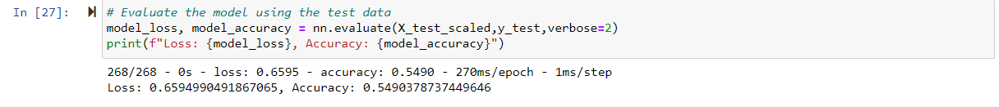
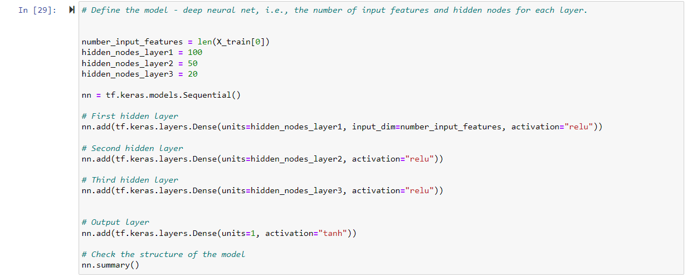
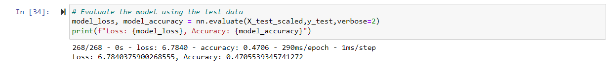

# Neural Network Charity Analysis

## Project Overview

Using machine learning and neural networks, a binary classifier was created to predict whether applicants funded by Alphabet  Soup would be successful. The process is comprised of three main steps: 

* Preprocess the data

* Compile, train, and evaluate.

* Optimize the data

## Resources

### Data Sources 

charity_data.csv
	

### Software 

Jupyter Notebook

## Results

### Data Reprocessomg 

The considered target variable is the IS_SUCCESSFUL column 

The features for the model are all columns except the target and those that are dropped.

Dropped columns include EIN and  NAME.

### Compiling, Training, and  Evaluating the  Model

My original neural network model had two hidden layers, the first with 80, the second with 30  with the relu activation function as well as an output layer with the activation function of sigmoid.

This model was able to achieve 66.5% accuracy, falling short of the 75% goal.
Three additional  attempts were completed to attempt to reach the 75% goal:

### Attempt 1

Accuracy:  61%

The USE_CASE column was removed, all other variables remain the same, accuracy decreased.

### Attempt 2 

Accuracy:  54.9%

A third hidden layer was added, accuracy still remains lower than original model. 

### Attempt 3

Accuracy: 47% 

Activation function changed from sigmoid to tanh. Resulted in lowest accuracy yet for a model.

## Summary

After optimization attempts, the highest accuracy was still the initial network score of 66.5%. Further optimization attempts could be conducted, altering the number of features, or adding data.  Other algorithms with more robust models could have also been utilized to prevent overfitting
